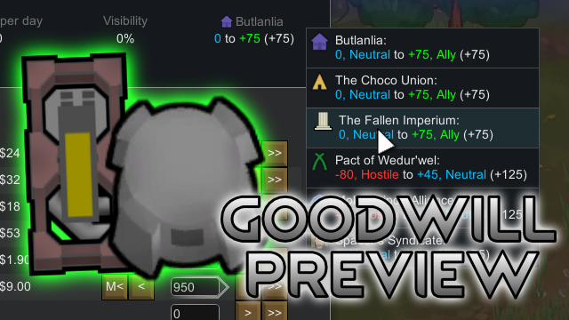

# Goodwill Preview

## Features & How to Use

- Displays faction goodwill changes in the transport pod launch dialog.
  - Click to open a dropdown menu to select the faction.

- 輸送ポッド荷積みダイアログに、各派閥への友好値変動を表示します。
  - クリックで表示する派閥を切り替え

## Languages

| Language | Contributor |
| -------- | ----------- |
| English  | -           |
| Japanese | -           |

If you share a link to the translation file, I'll include it in the mod.
